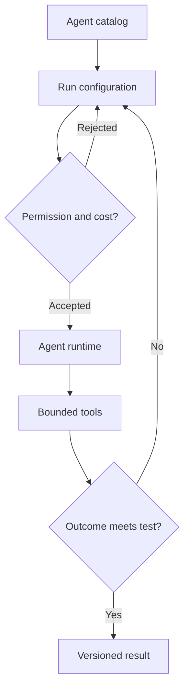

[← All systems](https://github.com/J0UH) · [Agentic systems](https://github.com/J0UH/agentic-systems)

  

# AI agent marketplace

A marketplace for agents is not a grid of prompts. Each agent needs a clear job, known tools, understandable limits, a way to evaluate quality, and an operating model that survives more than one impressive demo.

## The engineering problem

Specialised agents vary in risk, latency, cost, and evidence needs. The platform had to make those differences visible while giving users a consistent way to configure and run them.

## Foundation and adaptation

The experimentation studio is adapted from Microsoft's [AutoGen Studio](https://github.com/microsoft/autogen), while the agent catalog and product operating model were developed for Aryze. The two are intentionally separated so upstream runtime work is not presented as an in-house invention.

## What the system covers

- Agent discovery and configuration
- Tool and permission declarations
- Run state and output handling
- Evaluation and review workflows
- Multi-agent experimentation
- Product and operator interfaces

## System shape

## Build notes

- Describe the job and stop condition before the persona.
- Expose permissions and cost before a run starts.
- Keep evaluation data attached to the version that produced it.

Built at Aryze around Microsoft AutoGen Studio and private Aryze product work. Microsoft and AutoGen contributors retain upstream authorship and licensing; Aryze owns its private catalog, integration, product, and operating work.

## Talk through a similar problem

Working on something similar? [Tell me about it](mailto:ju@jomena.group?subject=AI%20agent%20marketplace).
