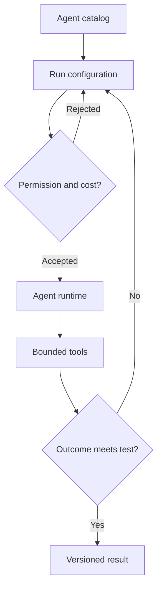

[← All work](https://github.com/J0UH) · [Agentic systems](https://github.com/J0UH/agentic-systems)

# AI agent marketplace

Exploring how specialised agents can become understandable products with clear jobs, tools, and limits.

Two agents can look similar in a catalogue while behaving very differently once they start work. One may need sensitive tools, another may take longer, and a third may produce a result that needs review.

The marketplace work focuses on making those differences understandable. Someone choosing an agent should be able to see what job it is meant to do and what a successful result would look like.

## Knowing what you are starting

Configuration includes the tools and permissions involved, the expected cost, and how the run will be observed. Those details belong before the run starts.

The experimentation studio adapts Microsoft's AutoGen Studio. The catalogue and product operating model sit around that foundation and have their own responsibilities: discovery, configuration, evaluation, and the handling of results.

I want an agent's evaluation to remain attached to the version that produced it. That makes comparisons more useful and helps explain whether a change improved the work or simply made the demo look different.

## Built on

The experimentation studio is adapted from Microsoft's [AutoGen Studio](https://github.com/microsoft/autogen). The agent catalog and product operating model sit outside that upstream runtime, so the two bodies of work remain clearly separated.

## What the work covers

- Agent discovery and configuration
- Tool and permission declarations
- Run state and output handling
- Evaluation and review workflows
- Multi-agent experimentation
- Product and operator interfaces

A closer look at the technical flow

## Related work

- [Agentic systems](https://github.com/J0UH/agentic-systems)
- [Personal AI employee](https://github.com/J0UH/personal-ai-employee)

Working on a similar problem? [Tell me what you are building](mailto:ju@jomena.group?subject=AI%20agent%20marketplace).

*This is a public account of the work. Source code and private operating details are not included in this repository.*
