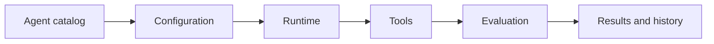

  

# AI agent marketplace

A marketplace for agents is not a grid of prompts. Each agent needs a clear job, known tools, understandable limits, a way to evaluate quality, and an operating model that survives more than one impressive demo.

[Discuss a similar system](mailto:ju@jomena.group?subject=Discuss%20AI%20agent%20marketplace) | [Book a technical call](mailto:ju@jomena.group?subject=Book%20a%20technical%20call%20about%20AI%20agent%20marketplace)

## The engineering problem

Specialised agents vary in risk, latency, cost, and evidence needs. The platform had to make those differences visible while giving users a consistent way to configure and run them.

## What the system covers

- Agent discovery and configuration
- Tool and permission declarations
- Run state and output handling
- Evaluation and review workflows
- Multi-agent experimentation
- Product and operator interfaces

## System shape

## Build notes

- Describe the job and stop condition before the persona.
- Expose permissions and cost before a run starts.
- Keep evaluation data attached to the version that produced it.

Built under the Aryze umbrella. The underlying source and company IP remain private and owned by Aryze. Delivery involved people across engineering, product, operations, compliance, and design. Open-source foundations retain their original attribution and licences.

## Talk through a similar problem

If you are trying to build, untangle, or ship a system in this area, [send me a note](mailto:ju@jomena.group?subject=I%20need%20help%20with%20AI%20agent%20marketplace). If the problem needs a deeper technical conversation, [book a call by email](mailto:ju@jomena.group?subject=Book%20a%20technical%20call%20about%20AI%20agent%20marketplace).
